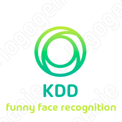
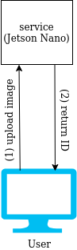

<!-- all comment are written here -->
<!-- Project logo-->
<p align="center">
<a href="https://github.com/kcsmta/KDD_FaceRegcogService">
    
</a>
</p>

<h2 align="center">
    Funny Face Recognition Service
</h2>

The project was created on a tedious April night in just 3 hours. 
And we decided to call it Funny Recognition Service.
<!-- TABLE OF CONTENTS-->
## Table of contents
* [Introduction](#introduction)
* [Installation](#installation)
* [Usage](#usage)
* [Contact](#contact)
* [Acknowledments](#acknowledments)


<!-- INTRODUCTION -->
## Introduction
We develop a simple face recognition service that runs on [Jetson Nano board](https://developer.nvidia.com/embedded/jetson-nano-developer-kit) 
which can perform some simple tasks like  face detection and face recognition automatically. User can upload an image 
which contains only one face to service and receive ID number equivalent to the face.
The process of system is shown below:
<p align="center">
    
</p>

All source code are available to run on 
[Jetson Nano board](https://developer.nvidia.com/embedded/jetson-nano-developer-kit).


<!-- INSTALLATION -->
## Installation
**Important Note:**  This installation is for Linux only. For MacOS/ Windows, please take a look at the detailed instruction of each individual component.
* Python 3.5+ is required.

<h3>Ubuntu</h3>

**1. Clone project**

```sh
git clone https://github.com/kcsmta/KDD_FaceRecogService.git
```

**2. Run following command:**

```sh
# Create virtual enviroment
python venv funny-face-recognition-env
# Active virtual enviroment
source funny-face-recognition-env/bin/activate
# Install requirement packages
(venv) pip install -r requirements.txt
```

<!-- USAGE -->
## Usage
Update soon!
* Run service

```sh
    python service.py
```


<!--CONTACT -->
## Contact
We are [Khanh Nguyen](https://www.facebook.com/khanh.nguyen.98229), 
  [Dat Tran](https://www.facebook.com/SoKool.HandSome.97),
  [Dan Pham](https://www.facebook.com/Pham.Dan.cntt2)\
Project Link: https://github.com/kcsmta/KDD_FaceRecogService  
Facenet model's weights link:  https://bit.ly/2yMpY51 
<!-- ACKNOWLEDMENTS-->
## Acknowledments
* [MTCNN]()
* [facenet]()
